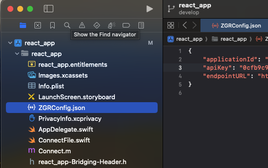
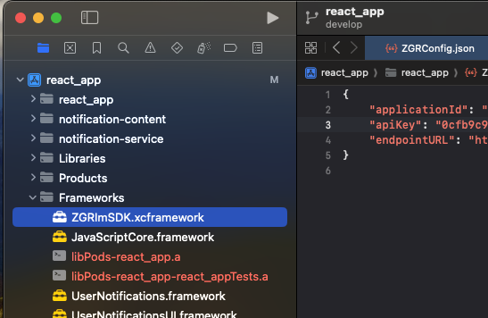
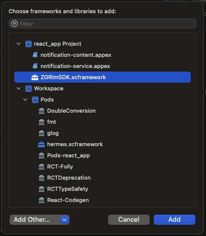
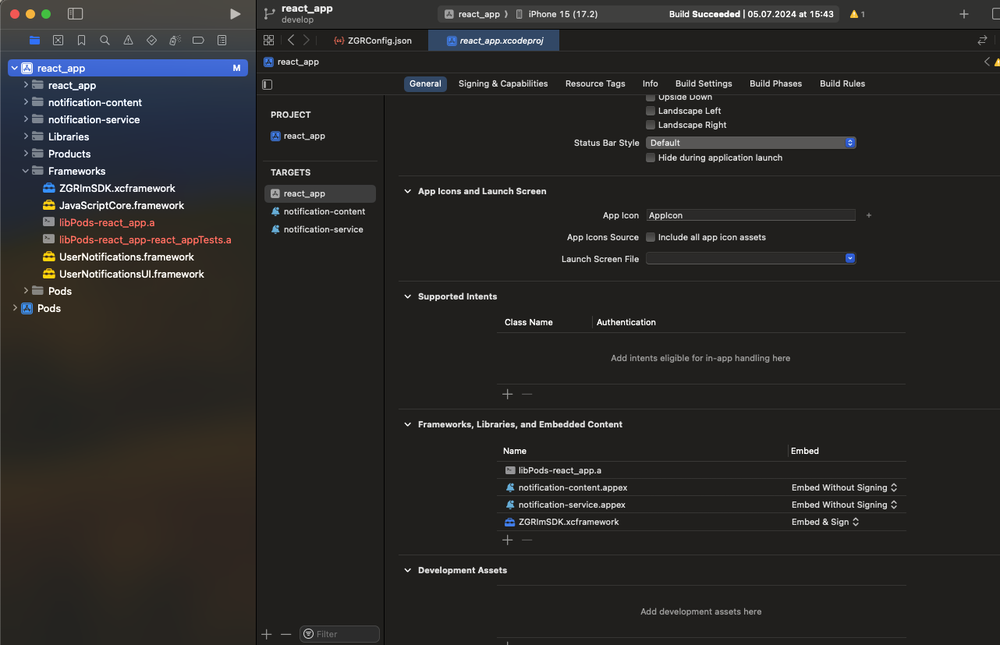
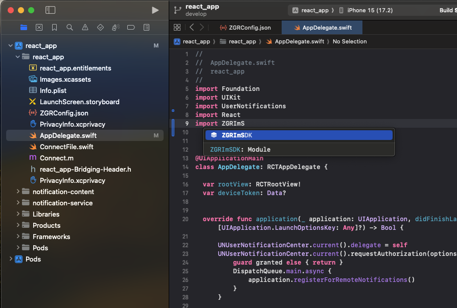
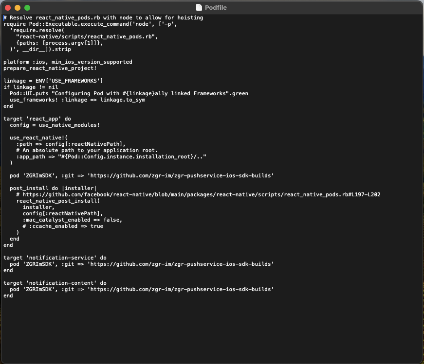
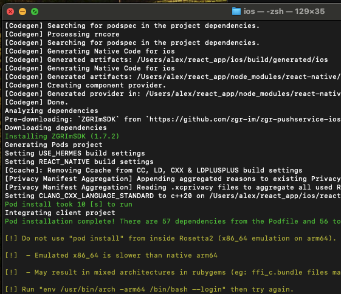
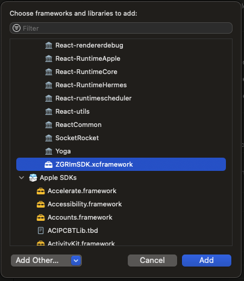
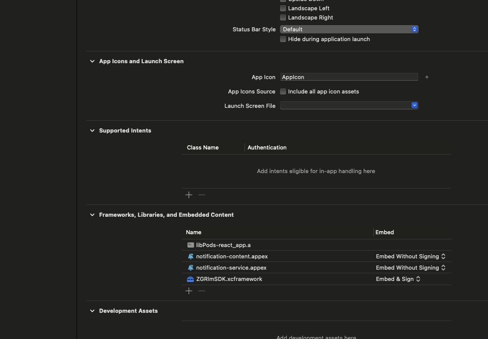
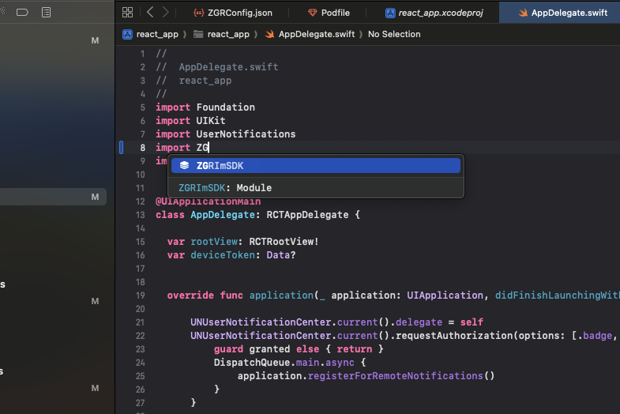

# Интеграция библиотеки ZGRImSDK в мобильное приложение, основанное на фреймворке React Native

## Интеграция в ручном режиме

* Убедиться в наличии всех необходимых файлов от ZGR.
    * `ZGRConfig.json` (файл конфигации)
    * `ZGRImSDK.xcframework` (динамическая универсальная библиотека)
    
* Открыть Xcode и установить фреймворк в приложение: 
    1. Перетянуть полученный от ZGR конфигурационный файл `ZGRConfig.json` в корневой каталог в иерархии файлов проекта (левая панель в `Xcode`)
    
    
    
    2. Активировать чек-бокс `Copy items if needed`
    3. Перетянуть файл `ZGRImSDK.xcframework` в каталог Frameworks (левая панель в `Xcode`). В случае, если в проекте отсутствует папка Frameworks, перетянуть файл `ZGRImSDK.xcframework` в раздел Frameworks, Libraries, and Embedded Content на центральном экране основного таргета приложения.
    
    
    
    4. Активировать чек-бокс `Copy items if needed`
    5. Перейти в основные настройки таргета приложения (первая вкладка), к разделу `Frameworks, Libraries and Embedded Content`, нажать "+"
    6. В открывшемся меню выбрать библиотеку `ZGRImSDK.xcframework`, нажать "Add"
    
    
    
    7. Убедиться, что библиотека будет встроена в приложение посредством установки пункта `Embed & Sign`
    
    
    
    8. Проверить интеграцию приложения и SDK. Открыть файл `AppDelegate` и выполнить команду `import ZGRImSDK`. Библиотека должна быть доступна для импорта.
    
    

## Интеграция c помощью менеджера пакетов CocoaPods

* Открыть Xcode и установить фреймворк в приложение:
    1. Перетянуть полученный от ZGR конфигурационный файл `ZGRConfig.json` в  в иерархию файлов проекта (левая панель в `Xcode`)

    

    2. Активировать чек-бокс `Copy items if needed`
    3. Создать `podfile` и отредактировать таким образом, чтобы библиотека `ZGRImSDK.xcframework` устанавливалась и в основное 
        приложение и в расширения.

    
    
    4. Выполнить команду `pod install`. Убедиться, что необходимые библиотеки интегрированы в проект.

    
    
    5. Перейти в основные настройки таргета приложения (первая вкладка), к разделу `Frameworks, Libraries and Embedded Content`, нажать "+"
    6. В открывшемся меню выбрать библиотеку `ZGRImSDK.xcframework`, нажать "Add"

    
    
    7. Убедиться, что `pod` c библиотекой будет встроен в приложение посредством установки пункта `Embed & Sign`

    
    
    8. Проверить интеграцию приложения и SDK. Открыть файл `AppDelegate` и выполнить команду `import ZGRImSDK`. Библиотека должна быть доступна для импорта.
    
    

### Дальнейшие шаги по интеграции библиотеки в части создания и настройка расширений, а также настройки  `App Group` идентичны описанным в файле `manually_instalation.md`, начиная с раздела  `Создание и настройка расширений приложения`.
