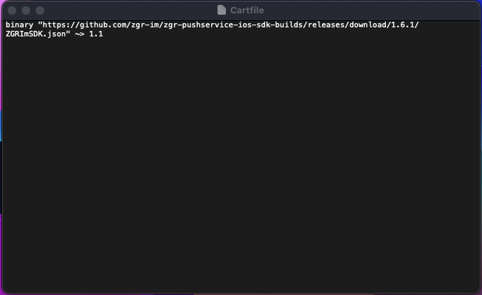
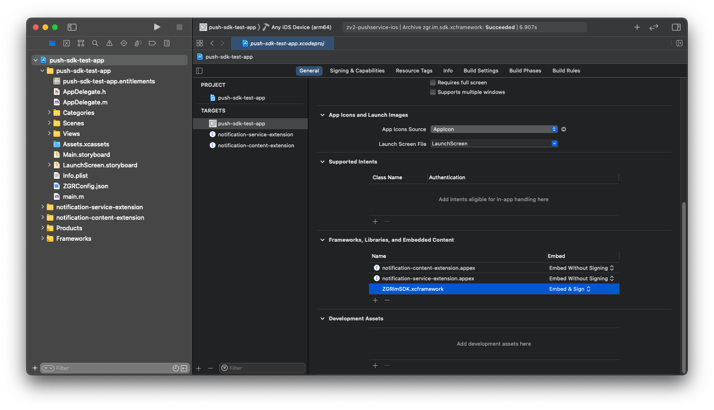

# Интеграция библиотеки ZGRImSDK c помощью менеджера пакетов Carthage.

## Настройка основного приложения

1. Перетянуть полученный от ZGR конфигурационный файл `ZGRConfig.json` в  в иерархию файлов проекта (левая панель в `Xcode`)
2. Активировать чек-бокс `Copy items if needed`
3. Создать `Cartfile`. Поскольку распространение библиотеки происходит в виде  `xcframework` а, вам необходимо использовать версию Garthage >= 0.38.0, которая поддерживает работу с XCFramework. Обратите внимание, что необходимо использовать в  `Cartfile` команду  `binary`. Версия текущего релиза библиотеки -  `1.6.1`, соответственно путь до json-файла имеет вид `https://github.com/zgr-im/zgr-pushservice-ios-sdk-builds/releases/download/1.6.1/ZGRImSDK.json` . 

    

    Для скачивания библиотеки необходимо использовать команду  `carthage update --use-xcframeworks`.   

4. Перетянуть файл `ZGRImSDK.xcframework` в иерархию файлов проекта (левая панель в `Xcode`)
5. Активировать чек-бокс `Copy items if needed`
6. Перейти в основные настройки таргета приложения (первая вкладка), к разделу `Frameworks, Libraries and Embedded Content`, нажать "+"
7. В открывшемся меню выбрать библиотеку `ZGRImSDK.xcframework`, нажать "Add"
8. Убедиться, что библиотека будет копироваться в бандл вашего приложения посредством установки пункта `Embed & Sign`
    
    

### Дальнейшие шаги по интеграции библиотеки в части создания и настройка расширений, а также настройки  `App Group` идентичны описанным в файле `manually_instalation.md`, начиная с раздела  `Создание и настройка расширений приложения`.
