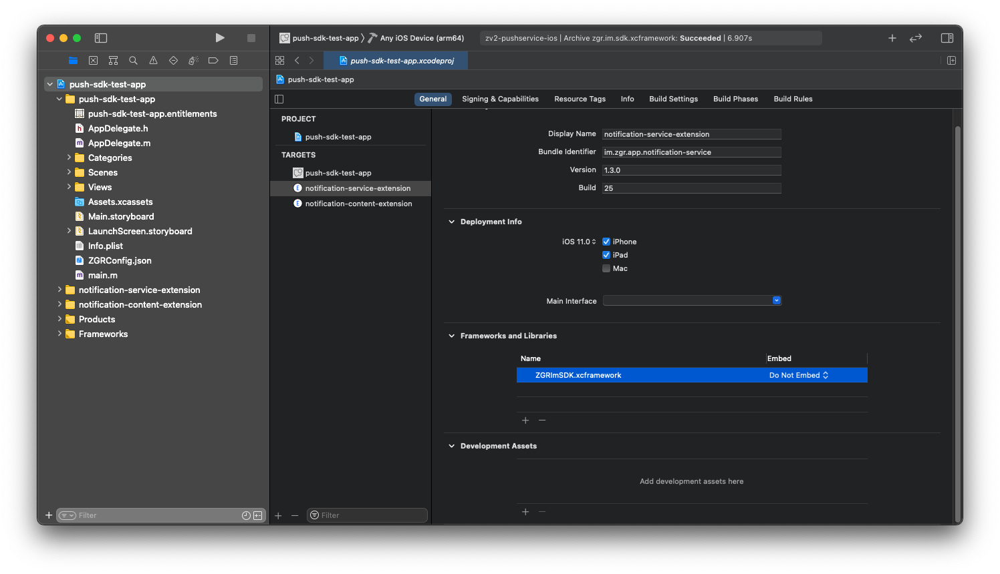
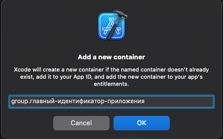
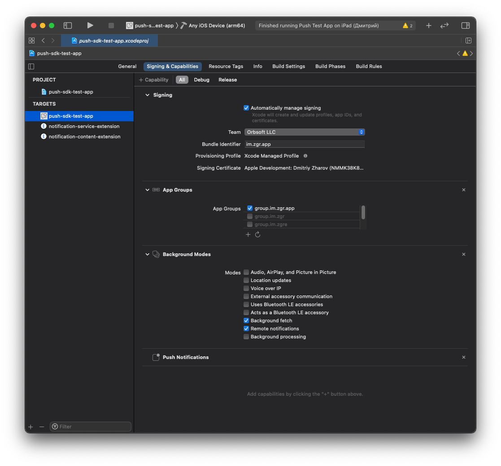
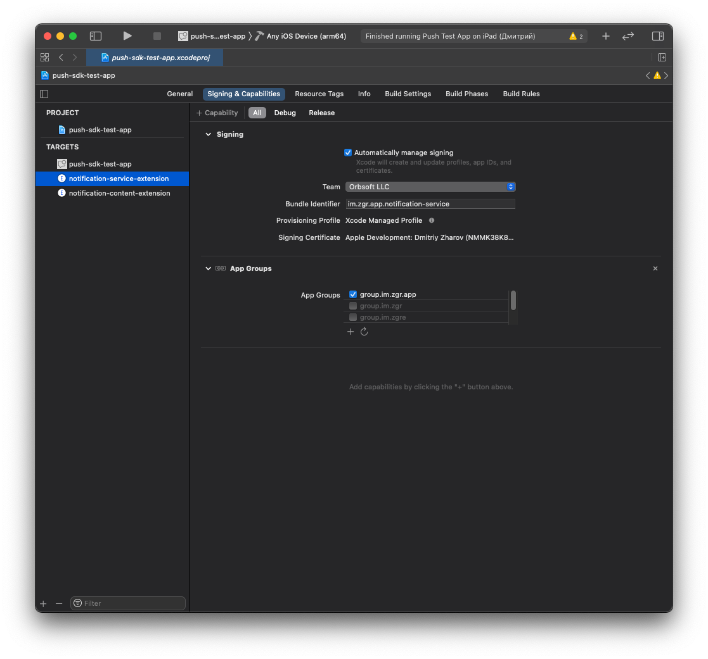
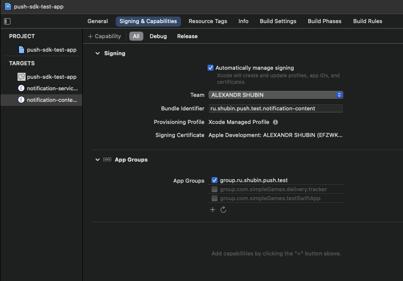
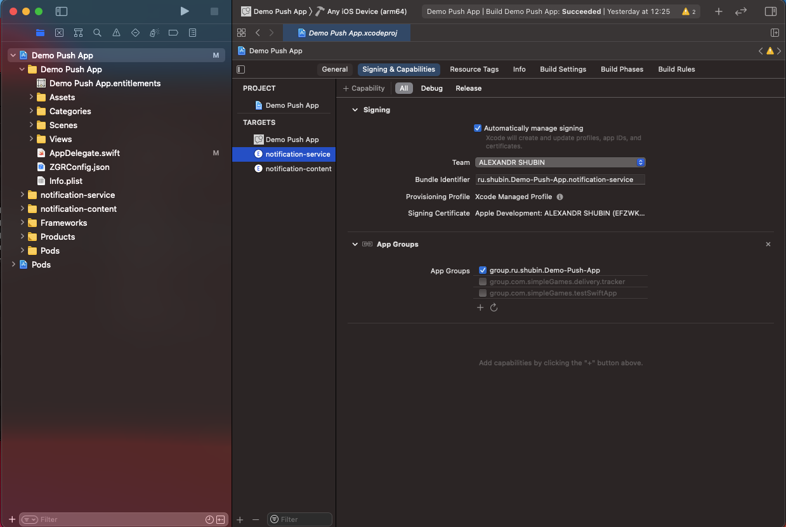
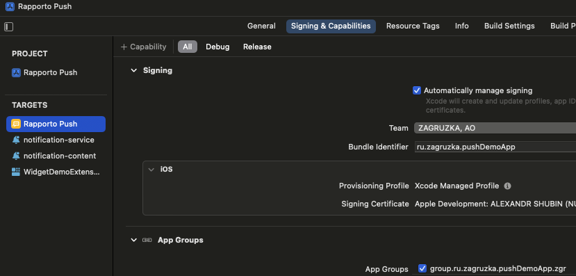
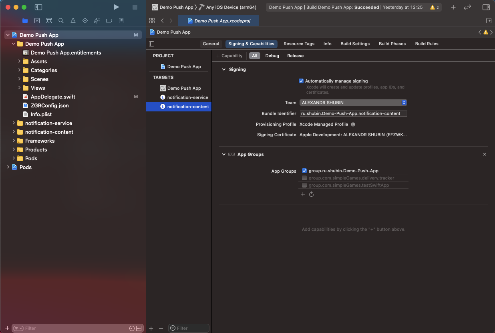
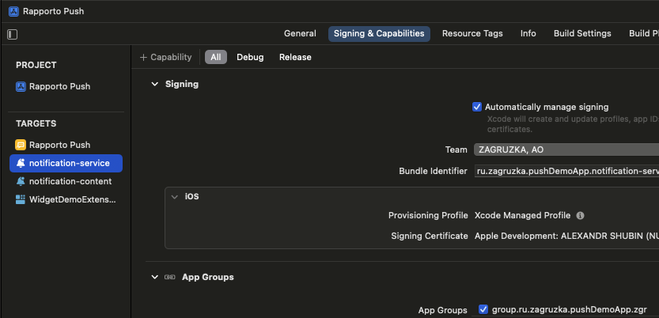
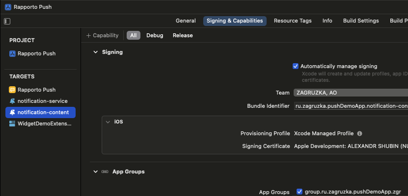

# Интеграция библиотеки ZGRImSDK в мобильное приложение в ручном режиме

## Настройка основного приложения

* Убедиться в наличии всех необходимых файлов от ZGR.
    * `ZGRConfig.json` (файл конфигурации)
    * `ZGRImSDK.xcframework` (динамическая универсальная библиотека)
    
* Открыть Xcode и установить фреймворк в приложение: 
    1. Перетянуть полученный от ZGR конфигурационный файл `ZGRConfig.json` в иерархию файлов проекта (левая панель в `Xcode`)
    2. Активировать чек-бокс `Copy items if needed`
    3. Перетянуть файл `ZGRImSDK.xcframework` в иерархию файлов проекта (левая панель в `Xcode`)
    4. Активировать чек-бокс `Copy items if needed`
    5. Перейти в основные настройки таргета приложения (первая вкладка), к разделу `Frameworks, Libraries and Embedded Content`, нажать "+"
    6. В открывшемся меню выбрать библиотеку `ZGRImSDK.xcframework`, нажать "Add"
    7. Убедиться, что библиотека будет копироваться в бандл вашего приложения посредством установки пункта `Embed & Sign`
    
    

## Создание и настройка расширений приложения

### Notification Service Extension
* Обязательно для корректной работы SDK.

Сервис, занимающийся в фоне отправкой отчетов о прочтении.

* Создать расширение приложения (extension)
    1. Зайти в меню приложения и на левой панели в нижнем левом углу нажать "+"
    2. В списке расширений выбрать `Notification Service Extension`
    3. Ввести любое название, например:  `notification-service`
    3. Во всплывающем запросе на активацию новосозданной схемы выбрать "Cancel"

* Связать сервис уведомлений с библиотекой `ZGRImSDK.xcframework`
    1. Перейти в основные настройки таргета  `Notification Service Extension`, раздел `Frameworks, Libraries and Embedded Content`, нажать "+"
    2. В открывшемся меню выбрать  `ZGRImSDK.xcframework`, нажать "Add".
    3. Библиотека уже скопирована основным таргетом в бандл приложения, поэтому здесь мы выбираем `Do Not Embed`.
    
    

### Notification Content Extension

* Опционально. Не влияет на корректную работу SDK.

Сервис, занимающийся отображением расширенного медиаконтента в пуш-уведомлении.

* Создать расширение приложения (extension).
    1. Зайти в меню приложения и на левой панели в нижнем левом углу нажать "+"
    2. В списке расширений выбрать `Notification Content Extension`
    3. Ввести любое название, например:  `notification-content`
    3. Во всплывающем запросе на активацию новосозданной схемы выбрать "Cancel"

* Связать сервис уведомлений с библиотекой `ZGRImSDK.xcframework`
    1. Перейти в основные настройки таргета  `Notification Content Extension`, раздел `Frameworks, Libraries and Embedded Content`, нажать "+"
    2. В открывшемся меню выбрать  `ZGRImSDK.xcframework`, нажать "Add".
    3. Библиотека уже скопирована основным таргетом в бандл приложения, поэтому здесь мы выбираем `Do Not Embed`.
    
    

## Настройка App Group

* Данный шаг необходимо выполнить для возможности синхронизации конфигурации и локальной базы данных пушей между основным приложением и его расширениями. Если у вас возникнут трудности с этим шагом, то вам помогут приложенные к инструкции изображения `App_Group_*`.

### Стандартный метод формирования имени группы
В нашем SDK стандартным методом формирования имени группы в приложении принята формула `group. + основной бандл приложения`.

* Добавить `Сapability` -> `App Group` в возможности вашего приложения.
    1. Перейти в настройки основного таргета вашего приложения.
    2. Перейти во вкладку `Signing & Capabilities`.
    3. Нажать кнопку `+ Capability`.
    4. Выбрать `App Groups`.
    5. В появившемся разделе `App Groups` нажать кнопку `+ (Создание новой группы)`.
    6. В окне `Add a new container` после `group.` ввести идентификатор вашего приложения (`bundle identifier`).
    
        
        
        - Пример: приложение имеет идентификатор `ru.zagruzka.TestApp`, в данное поле необходимо ввести строку `group.ru.zagruzka.TestApp`.
        
        
    
        
#### Без изменений повторить шаги 2-6 для таргетов `Notification Service Extension` и `Notification Content Extension`.
  
*   
    
    

    
### Нестандартный метод формирования имени группы

* В случае, если Вы не можете использовать стандартное имя группы, есть возможность использовать другое, которое вы можете зарегистрировать на портале Apple Developer.
Для примера будем считать, что бандл приложения `ru.zagruzka.pushDemoApp`, а группу мы хотим зарегистрировать `group.ru.zagruzka.pushDemoApp.zgr`.
    
* Необходимо повторить шаги по добавлению группы в приложение, описанные выше. 
    1. В окне ввода идентификатора группы ввести необходимую нам строку.
    
        
    
    2. Проверить, что группа создалась и имеет необходимый Вам идентификатор.
    
        
    
    3. В файле info.plist основного таргета приложения создать новую настройку с идентификатором ZGR_APP_GROUP_NAME_KEY типа String, и значением необходимого вам идентификатора группы.
    
        
        
### ВАЖНО!!! Если данную настройку не внести в файл info.plist, SDK будет считать, что формирование идентификатора группы в приложенни идет по стандартной формуле. Результатом ошибки может быть непредсказуемая работа приложения, недоставка необходимых статусов на бэкенд и остутствие записей о пришедших нотификациях в локальной БД. 
    
#### Повторить шаги 2-6 для таргетов `Notification Service Extension` и `Notification Content Extension`.

*   
    
    
