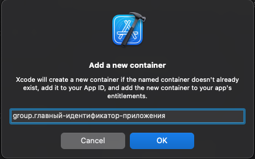
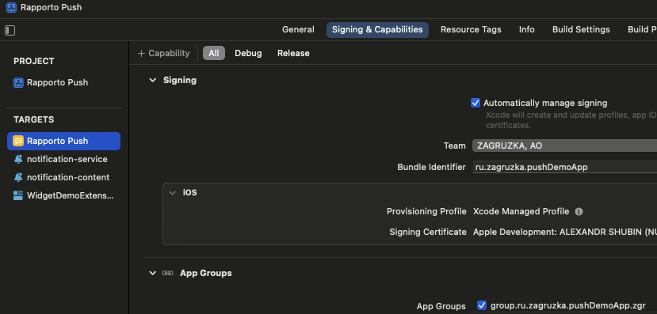
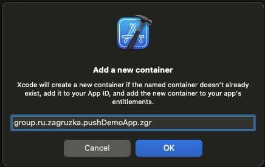
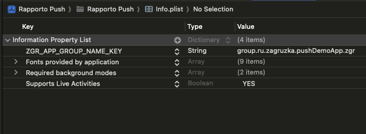

# Интеграция библиотеки ZGRImSDK c помощью менеджера пакетов CocoaPods.

## Настройка основного приложения

1. Перетянуть полученный от ZGR конфигурационный файл `ZGRConfig.json` в  в иерархию файлов проекта (левая панель в `Xcode`)
2. Активировать чек-бокс `Copy items if needed`
3. Создать `podfile` и отредактировать таким образом, чтобы библиотека `ZGRImSDK.xcframework` устанавливалась и в основное приложение и в расширения.
    
4. Убедиться, что `pod` c библиотекой будет копироваться в бандл вашего приложения посредством установки пункта `Embed & Sign`
    
    

## Создание и настройка расширений приложения

### Notification Service Extension
* Обязательно для корректной работы SDK.

Сервис, занимающийся в фоне отправкой отчетов о прочтении.

* Создать расширение приложения (extension)
    1. Зайти в меню приложения и на левой панели в нижнем левом углу нажать "+"
    2. В списке расширений выбрать `Notification Service Extension`
    3. Ввести любое название, например:  `notification-service`
    3. Во всплывающем запросе на активацию новосозданной схемы выбрать "Cancel"

* Проверить, что `pod` связывается с сервисом уведомлений установкой пункта `Do Not Embed`.
    
    

### Notification Content Extension
* Опционально. Не влияет на корректную работу SDK.

Сервис, занимающийся отображением расширенного медиаконтента в пуш-уведомлении.

* Создать расширение приложения (extension).
    1. Зайти в меню приложения и на левой панели в нижнем левом углу нажать "+"
    2. В списке расширений выбрать `Notification Content Extension`
    3. Ввести любое название, например:  `notification-content`
    3. Во всплывающем запросе на активацию новосозданной схемы выбрать "Cancel"

* Проверить, что `pod` связывается с сервисом уведомлений установкой пункта `Do Not Embed`.
    
    

## Настройка App Group

* Данный шаг необходимо выполнить для возможности синхронизации конфигурации и локальной базы данных пушей между основным приложением и его расширениями. Если у вас возникнут трудности с этим шагом, то вам помогут приложенные к инструкции изображения `App_Group_*`.

* Добавить `Сapability` -> `App Group` в возможности вашего приложения.
    1. Перейти в настройки основного таргета вашего приложения.
    2. Перейти во вкладку `Signing & Capabilities`.
    3. Нажать кнопку `+ Capability`.
    4. Выбрать `App Groups`.
    5. В появившемся разделе `App Groups` нажать кнопку `+ (Создание новой группы)`.
    6. В окне `Add a new container` после `group.` ввести идентификатор вашего приложения (`bundle identifier`).
        - Пример: приложение имеет идентификатор `im.zgr.app`, в данное поле необходимо ввести строку `group.im.zgr.app`.
    
        
  
  #### Без изменений повторить шаги 1-6 для таргетов `Notification Service Extension` и `Notification Content Extension`.
    
    
    
    
