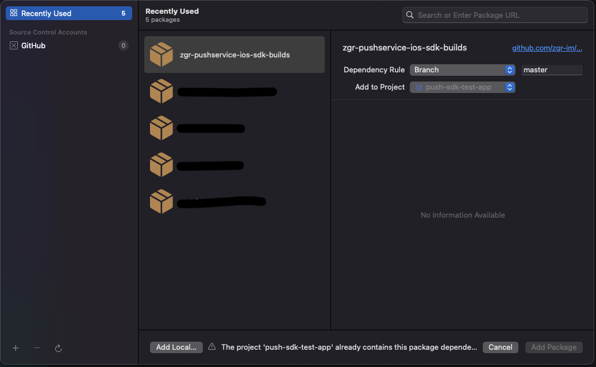

# Интеграция библиотеки ZGRImSDK c помощью Swift Package Manager.

## Настройка основного приложения

1. Перетянуть полученный от ZGR конфигурационный файл `ZGRConfig.json` в  в иерархию файлов проекта (левая панель в `Xcode`)
2. Активировать чек-бокс `Copy items if needed`
3. Выбрать в меню Files/Swift Packages/Add Package Dependency...
4. В всплывшем окне указать правильный путь до репозитория   

    

5. Далее выбираем необходимые опции (или оставляем всё по умолчанию): 

    

6. И подключаем пакет к таргету приложения: 

    

7. Перейти в основные настройки таргета приложения (первая вкладка), к разделу `Frameworks, Libraries and Embedded Content`, нажать "+"
8. В открывшемся меню выбрать библиотеку `ZGRImSDK.xcframework`, нажать "Add"
9. Убедиться, что библиотека будет копироваться в бандл вашего приложения посредством установки пункта `Embed & Sign`
    
    

#### Дальнейшие шаги по интеграции библиотеки в части создания и настройка расширений, а также настройки  `App Group` идентичны описанным в файле `manually_instalation.md`, начиная с раздела  `Создание и настройка расширений приложения`.
